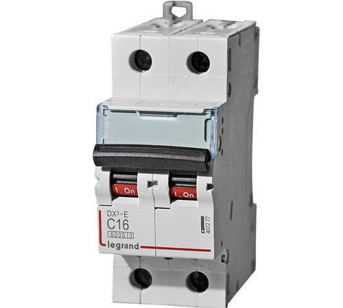

<!DOCTYPE html>
<html lang="en">
  <head>
    <!-- Global site tag (gtag.js) - Google Analytics -->
    
    
    <!-- Basic -->
    <meta charset="utf-8" />
    <meta http-equiv="X-UA-Compatible" content="IE=edge" />

    <!-- Mobile Metas -->
    <meta
      name="viewport"
      content="width=device-width, minimum-scale=1.0, maximum-scale=1.0, user-scalable=no"
    />

    <!-- Site Metas -->
    <title>Dynamic Elecpower</title>
    <meta name="keywords" content="" />
    <meta name="description" content="" />
    <meta name="author" content="" />

    <!-- Site Icons -->
    <link
      rel="shortcut icon"
      href="logo.jpg"
      type="image/x-icon"
    />
    <link rel="apple-touch-icon" href="logo.jpg" />

    <!-- Bootstrap CSS -->
    <link rel="stylesheet" href="css/bootstrap.min.css" />
    <!-- Site CSS -->
    <link rel="stylesheet" href="style.css" />
    <!-- Colors CSS -->
    <link rel="stylesheet" href="css/colors.css" />
    <!-- ALL VERSION CSS -->
    <link rel="stylesheet" href="css/versions.css" />
    <!-- Responsive CSS -->
    <link rel="stylesheet" href="css/responsive.css" />
    <!-- Custom CSS -->
    <link rel="stylesheet" href="css/custom.css" />
  </head>
  <body class="barber_version">
    <!-- LOADER -->
    

      

        

          
          
          
          
        

        

          

            

              

                

              

            

          

        

      

    

    <!-- end loader -->
    <!-- END LOADER -->

    

      <!-- Sidebar-wrapper -->
      

        

          

            
          

          <ul class="sidebar-nav">
            <li><a class="active" href="index.html">Home</a></li>
            <li><a href="Products.html">Products</a></li>
            <li><a href="sales&services.html">Sales & Services</a></li>
            <!-- <li><a href="sustainability.html">Sustainability</a></li> -->
            <li><a href="about.html">About Us</a></li>
            <li><a href="contact.html">Contact</a></li>
          </ul>
        

      

      <!-- End Sidebar-wrapper -->

      <!-- Page Content -->
      

        <a href="#menu-toggle" class="menuopener" id="menu-toggle"
          ><i class="fa fa-bars"></i
        ></a>

        

          

            

              

                

                  

                    

                      <h2>
                        <strong>Dynamic Elecpower</strong>  
                        <!-- Small steps towards a greener future -->
                        Introducing The Top-class electrical   
                        and industrial products  
                        <!--   -->
                      </h2>
                      <!-- 
Lorem ipsum dolor sit amet consectetur adipisicing elit. Ab distinctio recusandae corrupti.
 -->
                      <a
                        href="#"
                        class="btn btn-light btn-radius btn-brd grd1 effect-1 butn"
                        >VIEW CATALOGUE</a
                     `   
                      > 
                    

                  

                

              

            

            <!-- end row -->
          

          <!-- end container -->
          

            

              

                

                  

                    

                      <h2>
                        <strong>Dynamic Elecpower</strong> 
                        <!-- Natural Fibres Low Environmental Impact -->
                        <!--   -->
                        Amongest Top manufacturers  
                         and traders
                          
                         <!--   -->
                      </h2>
                      <!-- 
Lorem ipsum dolor sit amet consectetur adipisicing elit. Ab distinctio recusandae corrupti.
 -->
                      <a
                        href="#"
                        class="btn btn-light btn-radius btn-brd grd1 effect-1 butn"
                        >VIEW CATALOGUE</a
                      >
                    

                  

                

              

            

            <!-- end row -->
          

          <!-- end container -->
          

            

              

                

                  

                    

                      
                      <h2>
                        <strong>Dynamic Elecpower</strong> 
                        <!-- Fabrics for a Sustainable Future -->
                         
                        A Nationwide Trusted Campany
                         
                        <!--   -->
                      </h2>
                      <!-- 
Lorem ipsum dolor sit amet consectetur adipisicing elit. Ab distinctio recusandae corrupti.
 -->
                      <a
                        href="#"
                        class="btn btn-light btn-radius btn-brd grd1 effect-1 butn"
                        >VIEW CATALOGUE</a
                      >
                    

                  

                

              

            

            <!-- end row -->
          

          <!-- end container -->
        

        <!-- end section -->

        <section class="section nopad cac text-center">
          <a href="#"><h3>Interested in our top quality products?</h3></a>
        </section>

        

          

            

              

                

                  <h2>Welcome to Dynamic Elecpower</h2>
                  <h4> Campany Profile </h4>
                  <!-- 

                    From Hemp, Linen, Organic Cotton, and more. We’re here to
                    help.
                  
 -->
                  

                    Dynamic Elecpower Pvt. Ltd. is Bhilwara, Rajasthan, India based quality-focused manufacturing company, indulged in introducing premium quality ABB MCCB Circuit Breaker, Distribution Power Transformer, Industrial Voltage Stabilizer and more products. We are proud members of Mewar Chamber of Commerce & Industry and Bhilwara textile trade federation. Also, we are channel partners for various reputed organizations such as Legrand, Elmeasure, ABB, Kaycee.
                  

                  <a
                    href="sales&services.html"
                    data-scroll
                    class="btn btn-light btn-radius btn-brd grd1 effect-1"
                    >Learn More</a
                  >
                

                <!-- end messagebox -->
              

              <!-- end col -->
            

            <!-- end row -->

            

            

              

                

                  <ul class="nav nav-tabs">
                    <li class="active">
                      <a href="#tab_a" data-toggle="tab">Our Vision</a>
                    </li>
                    <li><a href="#tab_b" data-toggle="tab">Our Values</a></li>
                    <li><a href="#tab_c" data-toggle="tab">Our Leaders</a></li>
                  </ul>
                  

                    

                      
                      <ul>

                      <li> 
To provide supreme grade electrical products at reasonable costs 
</li> 
                      <li> 
To maintain in our network talented professionals to satisfy customer’s requirements
</li>  
                      <li> 
To test products in an advanced manner and ensure flawlessness in products
</li>  
                      <li> 
To maintain transparency in deals with customers 
</li> 
                      <li> 
To attain our goal of starting export in coming years
 </li> 

                    </ul>

                    

                    

                      <ul>
                       <li> Teamwork</li>  
                       <li> Honesty</li>  
                       <li> Integrity</li>  
                       <li> Customer Satisfaction</li> 
                       <li> Trustworthy Relationship</li> 
                       <li> Transparency</li>

                      </ul>

                      <!-- 

                        We provide high-quality curated low impact fabrics and
                        supplies
                      

                      

                        We offer a wide range of fabrics, including natural and
                        recycled fabrics, with an emphasis on fabrics that are
                        environmentally and socially responsible. Ultimately, we
                        hope to offer brands, designers and creators the
                        resources and materials to bring their designs to life.
                      
 -->
                      <!-- <ul>
											<li><i class="fa fa-circle-o" aria-hidden="true"></i>User Experince</li> 
											<li><i class="fa fa-circle-o" aria-hidden="true"></i>Full Devices</li> 
											<li><i class="fa fa-circle-o" aria-hidden="true"></i>Awesome Design</li> 
											<li><i class="fa fa-circle-o" aria-hidden="true"></i>Visual Impact</li> 
											<li><i class="fa fa-circle-o" aria-hidden="true"></i>100% Sincronized</li> 
											<li><i class="fa fa-circle-o" aria-hidden="true"></i>Custom Support</li> 
										</ul> -->
                    

                    

                      

                        Mr. S. K. Lodha (M.D.): Holding Electrical Engineer degree from BITS Pilani, he started business in the late nineties. 

                        
Mr. Samarth Lodha (Director): He is looking after production of Panels, LTs, Switch boards, and Control and Relay Panels. 

                        
Mrs. Madhu Lodha (Director- Accounts & Finance): She manages accounts related all business works.

                        
Mr. Yogeshwar Rathore (Accounts Manager): He looks after general accounts work and also handles HR work.
 
                        
Mr. Vinay Dadhich (Accounts Manager): He managed Tax related business works.

                        
Mr. Suraj Mali (Manager- Projects): He is a Designer Engineer, holding expertise in well-handling turnkery projects. He holds B. Tech degree in electrical engineering.

                        
Mr. L.L Laxkar (Manager- Sales): He looks after trading of products.

                      
                    

                  

                  <!-- tab content -->
                

              

              <!-- end col -->
            

            <!-- end row -->

            

            

              

                

                  

                    <a
                      href="image/5.jpg"
                      data-rel="prettyPhoto[gal]"
                      class="hoverbutton global-radius"
                      ><i class="flaticon-unlink"></i
                    ></a>
                    
                  

                  <h3>AMF Synchronising Control Panel</h3>
                  

                    We are occupied with the standard procedure of making different sorts of panel supplies to our significant supporters. Here we are giving a decent quality AMF Synchronising Control Panel that is likewise alluded to as programmed move switch boards. This AMF Synchronising Control Panel is the force change to crisis reserve generators in case of a noteworthy loss of mains force or all out power outage. We supply the same at a cost-effective price.
                  

                

                <!-- end service -->
              

              

                

                  

                    <a
                      href="image/4.jpg"
                      data-rel="prettyPhoto[gal]"
                      class="hoverbutton global-radius"
                      ><i class="flaticon-unlink"></i
                    ></a>
                    
                  

                  <h3>ABB ACB Circuit Breaker</h3>
                  

                    Backed by a team of professionals, we have been a proud manufacturer and suppliers of ABB ACB Circuit Breaker is the most significant gadget is electronic gear that is utilized for the insurance of electric circuits from short-circuits or over current. It is utilized in the exchanging instrument and assurance of the electrical framework. Offered ABB ACB Circuit Breaker is highly demanded in the market for its highly durable nature and delivered by us at fixed price rate. 
                  

                

                <!-- end service -->
              

              

                

                  

                    <a
                      href="image/6.jpg"
                      data-rel="prettyPhoto[gal]"
                      class="hoverbutton global-radius"
                      ><i class="flaticon-unlink"></i
                    ></a>
                    
                  

                  <h3>DOL Starter Control Panel</h3>
                  

                    Our organization is actively engaged in providing a premium quality DOL Starter Control Panel that is fundamentally engines where a high inrush current doesn't cause extreme voltage drop in the gracefully circuit. It is usually used to begin little water siphons, transport lines, fans, and blowers. This panel is highly demanded in the market because of its excellent performance and durability. Offered DOL Starter Control Panel can be avail from us at cost-effective price.
                  

                

                <!-- end service -->
              

            

            <!-- end row -->
          

          <!-- end container -->
        

        <!-- end section -->

        

          
          

            

              

                

                  <a href="index.html">Home</a>
                  <a href="sales&services.html">Sales & Services</a>
                  <a href="Products.html">Products</a>
                  <a href="about.html">About</a>
                  <a href="contact.html">Contact</a>
                

                

                  All Rights Reserved. &copy; 2021 <a href="#">Dynamic Elecpower</a>
                

              

              

                <form
                  name="newsletter"
                  method="post"
                  action="https://formspree.io/f/xknkrpvr"
                >
                  <input
                    placeholder="Subscribe our newsletter.."
                    name="email"
                  />
                  <i class="fa fa-envelope-o"></i>
                </form>

              

            

          

          <!-- end container -->
        

        <!-- end copyrights -->
      

    

    <!-- end wrapper -->

    <a href="#" id="scroll-to-top" class="dmtop global-radius"
      ><i class="fa fa-angle-up"></i
    ></a>

    <!-- ALL JS FILES -->
    
    
    <!-- ALL PLUGINS -->
    

    <!-- Menu Toggle Script -->
    
  </body>
</html>
